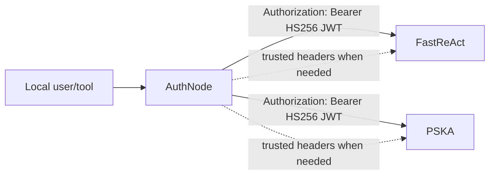

# AuthNode

AuthNode is a small local identity broker for FastReAct and PSKA development.
It is intentionally not a full SSO product yet. Its job is to provide the same
identity contract that a future SSO gateway or identity broker would provide:

- a SQLite-backed Local IAM catalog for environments without SSO;
- a local JSON username/password dev login for smoke tests;
- a Keycloak/OIDC browser login broker for production-like tests;
- HS256 JWTs accepted by FastReAct and PSKA;
- trusted headers accepted by FastReAct and PSKA;
- an optional local proxy that injects JWTs or trusted headers into upstream
  FastReAct and PSKA calls.

## Why this shape

FastReAct and PSKA should not each grow their own password login, org admin
console, or duplicate business ACL system. AuthNode centralizes the local
browser login and sits at the local
development boundary:



The important claim contract is:

- `sub`: FastReAct `user_key`, for example `pska:user_primary`;
- `tenant_key`: FastReAct tenant key;
- `tenant_id`: PSKA tenant id;
- `tenant`, `org_id`: compatibility aliases;
- `roles`, `groups`, `email`, `name`: profile metadata.

PSKA normalizes `pska:user_primary` to `user_primary` for its internal
`RequestContext.user_id`, while FastReAct keeps the full `user_key`.

## Quick start

Run AuthNode:

```bash
./start.sh
```

On first run, `./start.sh` creates `authnode.local.json` and initializes local
`jwt_secret`/`admin_token` automatically. For non-local use, inject the same JWT
secret into AuthNode, FastReAct, and PSKA through deployment secrets or
environment variables.

For the browser flow, open PSKA and let it redirect to AuthNode, or visit:

```text
http://127.0.0.1:8788/login?target=pska&return_to=http://127.0.0.1:5173/auth/callback&next=/
```

By default the example config uses `browser_login_provider=local_iam`.
Initialize the SQLite catalog and seed the example tenants/users with:

```bash
python -m authnode --config authnode.local.json iam init --seed-config
```

Local IAM stores passwords as Argon2id hashes in `./data/authnode.db`, enforces
tenant membership, writes audit events, and sets an AuthNode HttpOnly login
session. The JSON `users` array is only a seed/dev fallback, not the formal
account database.

Useful Local IAM commands:

```bash
python -m authnode --config authnode.local.json tenant create tenant_demo --name "Demo Tenant"
python -m authnode --config authnode.local.json user create demo_user --password 'change-me-now' --email demo@example.test
python -m authnode --config authnode.local.json membership add demo_user tenant_demo --roles writer --groups local
python -m authnode --config authnode.local.json audit list --limit 20
```

Existing private configs can keep `browser_login_provider=local` to use the old
JSON dev login. In that mode the local form asks for `tenant_id`, `username`,
and `password`; unknown users in non-strict local mode can use
`dev_login_password`.

To send normal browser login through Keycloak, set:

```json
{
  "browser_login_provider": "keycloak",
  "keycloak": {
    "issuer_url": "http://127.0.0.1:8080/realms/pska-local",
    "client_id": "authnode",
    "client_secret_env": "AUTHNODE_KEYCLOAK_CLIENT_SECRET",
    "redirect_uri": "http://127.0.0.1:8788/oidc/callback",
    "tenant_claims": ["tenant_id", "tenant_key"],
    "user_id_claims": ["preferred_username", "sub"]
  }
}
```

In Keycloak mode, `GET /login` redirects to the OIDC authorization endpoint.
`GET /login?local=1` still shows the local username/password form for dev and
E2E smoke tests.

Print environment variables for FastReAct and PSKA:

```bash
python -m authnode env
```

Issue a token:

```bash
python -m authnode token pska:user_primary --raw
```

Generate trusted headers:

```bash
python -m authnode headers pska:user_primary --target both --curl
```

Run in the background:

```bash
./start.sh --daemon
./start.sh --status
./start.sh --stop
```

AuthNode's own `./start.sh` only starts AuthNode. FastReAct and PSKA must be
started from their own repositories or containers; no project start script
should launch another project. Runtime logs and PID files stay inside this
repository under `logs/` and `run/`.

Use the local proxy:

```bash
curl "http://127.0.0.1:8788/proxy/pska/ready?authnode_user_key=pska:user_primary"
curl "http://127.0.0.1:8788/proxy/fastreact/ready?authnode_user_key=pska:user_primary"
```

## FastReAct configuration

For JWT mode:

```bash
export FASTREACT_AUTH_MODE=jwt
export AUTHNODE_JWT_SECRET='same-secret-injected-into-authnode'
export FASTREACT_AUTH_JWT_SECRET="$AUTHNODE_JWT_SECRET"
export FASTREACT_AUTH_JWT_ISSUER='authnode.local'
export FASTREACT_AUTH_JWT_AUDIENCE='fastreact'
export FASTREACT_AUTH_JWT_TENANT_CLAIMS='tenant_key,tenant_id,tenant,org_id'
```

FastReAct JSON config can also reference the env var instead of storing the
secret directly:

```json
{
  "auth": {
    "mode": "jwt",
    "jwt_secret_env": "AUTHNODE_JWT_SECRET",
    "jwt_issuer": "authnode.local",
    "jwt_audience": "fastreact"
  }
}
```

For trusted-header mode:

```bash
export FASTREACT_AUTH_MODE=trusted_headers
```

## PSKA configuration

For JWT mode:

```bash
export PSKA_AUTH_MODE=jwt
export AUTHNODE_JWT_SECRET='same-secret-injected-into-authnode'
export PSKA_AUTH_JWT_SECRET="$AUTHNODE_JWT_SECRET"
export PSKA_AUTH_JWT_ISSUER='authnode.local'
export PSKA_AUTH_JWT_AUDIENCE='pska'
export PSKA_AUTH_JWT_TENANT_CLAIMS='tenant_id,tenant_key,tenant,org_id'
```

For trusted-header mode:

```bash
export PSKA_AUTH_MODE=trusted_headers
```

## API

- `GET /health`
- `GET /ready`
- `GET /login`
- `POST /login`
- `GET /oidc/callback`
- `GET /logout`
- `POST /v1/auth/exchange`
- `GET /v1/tenants`
- `GET /v1/users`
- `POST /v1/token`
- `GET /v1/headers`
- `GET/POST/DELETE /v1/iam/tenants`
- `GET/POST/DELETE /v1/iam/users`
- `POST/DELETE /v1/iam/memberships`
- `POST/DELETE /v1/iam/roles`
- `POST /v1/iam/provider-accounts`
- `GET /v1/iam/audit`
- `ANY /proxy/{target}/{path}`

## Local IAM catalog

Local IAM is the no-Keycloak fallback. It is intentionally smaller than
Keycloak, but it is operationally real enough to run PSKA/FastReAct:

- SQLite catalog at `catalog_store.path`;
- Argon2id password hashes;
- tenant/user/membership/role/group records;
- AuthNode HttpOnly sessions;
- login failure rate limiting;
- audit events for login, user, tenant, membership, role, provider, and session
  operations.

The CLI manages the catalog directly and does not modify PSKA/FastReAct data:

```bash
python -m authnode iam init --seed-config
python -m authnode tenant list
python -m authnode user list
python -m authnode user reset-password alice --password 'new-password'
python -m authnode role grant alice tenant_acme admin
```

The same catalog operations are available as admin-token protected local JSON
APIs under `/v1/iam/*`. They are not browser UI endpoints; they are meant for
automation or a future management surface. They require `X-AuthNode-Admin-Token`
or `Authorization: Bearer <admin-token>` when `admin_token` is configured.

## Browser login code flow

For browser smoke tests, AuthNode provides a small OAuth-like code flow. The
browser never receives a PSKA/FastReAct service token, AuthNode admin token, or
downstream JWT in JavaScript.

1. PSKA Gateway redirects an unauthenticated browser to:

```text
http://127.0.0.1:8788/login?target=pska&return_to=http://127.0.0.1:5173/auth/callback&next=/
```

2. AuthNode either uses Local IAM, redirects to Keycloak and handles
   `/oidc/callback`, or shows the legacy JSON dev form when using
   `browser_login_provider=local` or `/login?local=1`.
3. AuthNode redirects back to PSKA Gateway with a short-lived one-time `code`.
4. PSKA Gateway calls `POST /v1/auth/exchange` server-side and receives an
   `aud=pska` JWT plus claims.
5. PSKA Gateway stores only a signed HttpOnly session cookie in the browser and
   proxies later API calls to PSKA with server-side identity material.

`/v1/auth/exchange` is intentionally separate from `/v1/token`: it consumes only
codes that AuthNode created through `/login`, and it does not require exposing
the AuthNode admin token to PSKA or the browser.

## Cross-project contract

The AuthNode/FastReAct/PSKA identity contract is documented in
`contracts/authnode-fastreact-pska.md`. Run the offline checker with:

For PSKA implementation work, give the PSKA coding agent this prompt:

```text
contracts/pska-coding-agent-authnode-prompt.md
```

```bash
python -m authnode contract pska:user_primary --tenant tenant_default
```

Optional live checks can call PSKA `/ready` and, when explicitly requested,
FastReAct `/v1/chat/completions`:

```bash
python -m authnode contract pska:user_primary \
  --tenant tenant_default \
  --live \
  --pska-url http://127.0.0.1:8765
```

`POST /v1/token` accepts:

```json
{
  "user_key": "pska:user_primary",
  "tenant_id": "tenant_default",
  "audience": ["fastreact", "pska"],
  "ttl_seconds": 28800
}
```

`GET /v1/headers` query parameters:

- `user_key`
- `tenant_id`
- `target`: `fastreact`, `pska`, or `both`
- `mode`: `trusted_headers` or `jwt`

If `admin_token` is configured, `/v1/token` and `/v1/headers` require either:

```http
X-AuthNode-Admin-Token: local-admin-token
Authorization: Bearer local-admin-token
```

## Strict identity mode

Local development defaults to a forgiving identity catalog: an unknown user can
be synthesized as `pska:<id>`, and an unknown tenant falls back to the default
tenant. For hardened local tests or production-like runs, enable strict mode:

```json
{
  "strict_identity": true,
  "admin_token": "local-admin-token",
  "allow_unknown_users": false,
  "allow_unknown_tenants": false
}
```

With this profile, AuthNode rejects unknown tenants and users instead of
silently creating local identities. In strict mode, `/v1/token` and
`/v1/headers` are unavailable unless `admin_token` is configured.

## Production direction

AuthNode can run in two production-shaped roles. Without a customer SSO, Local
IAM owns the tenant/user catalog, password hashes, browser sessions, membership
checks, and audit events. With Keycloak, Okta, Azure AD, SAML, LDAP, or a
customer-specific identity system, AuthNode should act as the adapter/broker:
verify the upstream identity, require tenant/user mapping, normalize
roles/groups/profile claims, optionally bind the external subject to a Local IAM
membership, and emit the same downstream JWTs or trusted headers. PSKA remains
responsible for knowledge ACLs; FastReAct remains responsible for
workspace/tool policy.
