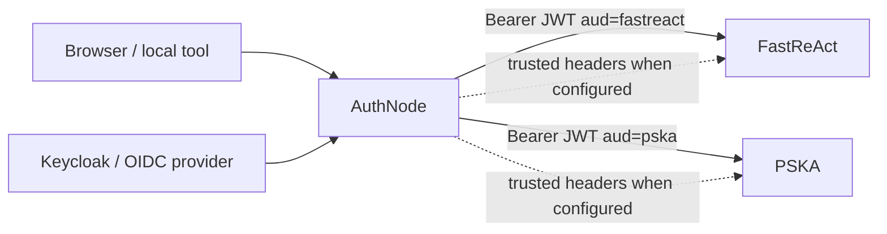

# AuthNode

AuthNode is a lightweight identity adapter for local PSKA and FastReAct
development. It gives downstream services a stable identity contract while
keeping the upstream login system replaceable.

Chinese version: [README.zh-CN.md](README.zh-CN.md)

## What It Is

AuthNode is intentionally small:

- It is a local identity broker for development, integration, and early
  deployment tests.
- It can authenticate users through Local IAM, legacy JSON dev users, or a
  Keycloak/OIDC authorization-code flow.
- It normalizes identity into JWTs or trusted headers consumed by PSKA and
  FastReAct.
- It is not meant to replace a company or customer OAuth/OIDC/IAM system.
- It is not a full OAuth 2.0 authorization server.

The practical goal is "enough identity infrastructure to develop safely"
without making every downstream service implement login, token exchange,
tenant mapping, and local test accounts separately.

## Architecture



AuthNode owns identity proof and tenant/user mapping at the local boundary.
PSKA still owns knowledge ACLs. FastReAct still owns workspace isolation, tool
policy, MCP routing, and audit behavior.

## Identity Contract

AuthNode emits a stable set of claims:

- `iss`: AuthNode issuer, usually `authnode.local`
- `sub`: stable subject, usually a full user key such as `pska:user_primary`
- `aud`: `pska`, `fastreact`, or both
- `tenant_id`: PSKA tenant id
- `tenant_key`: FastReAct tenant key
- `tenant`, `org_id`: compatibility aliases
- `user_id`, `user_key`
- `roles`, `groups`, `email`, `name`
- `provider`: `authnode`, `authnode-local-iam`, or `keycloak`

PSKA may normalize `pska:user_primary` to `user_primary` internally.
FastReAct should keep the full `user_key`.

The cross-project contract is documented in
[contracts/authnode-fastreact-pska.md](contracts/authnode-fastreact-pska.md).
For PSKA implementation work, use
[contracts/pska-coding-agent-authnode-prompt.md](contracts/pska-coding-agent-authnode-prompt.md).

## Requirements

- Python 3.11+
- `argon2-cffi`
- `PyJWT[crypto]`

Install in editable mode when developing AuthNode itself:

```bash
python3 -m venv .venv
. .venv/bin/activate
python -m pip install -e .
python -m pip install pytest
```

`./start.sh` can also run with the system `python3` if the dependencies are
already available.

## Quick Start

Start AuthNode in the foreground:

```bash
./start.sh
```

On first run, the script creates `.authnode/config.json` from
`authnode.example.json` and initializes local-only `jwt_secret` and
`admin_token` values. Do not commit `.authnode/config.json`. Existing
`authnode.local.json` files are still honored for compatibility.

Open the browser login flow directly:

```text
http://127.0.0.1:8788/login?target=pska&return_to=http://127.0.0.1:5173/auth/callback&next=/
```

Run as a background local service:

```bash
./start.sh --daemon
./start.sh --status
./start.sh --stop
```

Useful environment overrides:

```bash
export AUTHNODE_CONFIG=/path/to/.authnode/config.json
export AUTHNODE_HOST=127.0.0.1
export AUTHNODE_PORT=8788
export AUTHNODE_PYTHON=/path/to/python
```

AuthNode only starts AuthNode. Start PSKA and FastReAct from their own
repositories or containers.

## Local IAM Setup

The default example config uses:

```json
{
  "browser_login_provider": "local_iam",
  "identity_mode": "hybrid",
  "catalog_store": {
    "type": "sqlite",
    "path": "./data/authnode.db"
  }
}
```

Initialize and seed the SQLite catalog:

```bash
python -m authnode --config .authnode/config.json iam init --seed-config
```

Local IAM includes:

- SQLite tenant/user/membership records
- Argon2id password hashes
- role and group grants
- AuthNode HttpOnly login sessions
- login rate limiting
- audit events

Common commands:

```bash
python -m authnode --config .authnode/config.json tenant list
python -m authnode --config .authnode/config.json user list
python -m authnode --config .authnode/config.json tenant create tenant_demo --name "Demo Tenant"
python -m authnode --config .authnode/config.json user create demo_user --password 'change-me-now' --email demo@example.test
python -m authnode --config .authnode/config.json membership add demo_user tenant_demo --roles writer --groups local
python -m authnode --config .authnode/config.json user reset-password demo_user --password 'new-password'
python -m authnode --config .authnode/config.json membership list --include-disabled
python -m authnode --config .authnode/config.json user disable demo_user
python -m authnode --config .authnode/config.json user enable demo_user
python -m authnode --config .authnode/config.json audit list --limit 20
```

The admin-token protected JSON API exposes the same Local IAM operations under
`/v1/iam/*`.

## Add A Local Tenant And User

This is the normal local product-management flow for a new PSKA/FastReAct
tenant:

1. Start AuthNode:

```bash
./start.sh
```

2. Initialize the catalog if this is a fresh checkout:

```bash
python -m authnode --config .authnode/config.json iam init --seed-config
```

3. Create a tenant:

```bash
python -m authnode --config .authnode/config.json tenant create tenant_demo --name "Demo Tenant"
```

4. Create a user and set an initial password:

```bash
python -m authnode --config .authnode/config.json user create demo_user \
  --display-name "Demo User" \
  --email demo@example.test \
  --password 'change-me-now'
```

5. Add the user to the tenant and set roles/groups:

```bash
python -m authnode --config .authnode/config.json membership add demo_user tenant_demo \
  --roles writer \
  --groups local
```

6. Reset the password when needed:

```bash
python -m authnode --config .authnode/config.json user reset-password demo_user --password 'new-password'
```

7. Log in through the browser flow:

```text
http://127.0.0.1:8788/login?target=pska&return_to=http://127.0.0.1:5173/auth/callback&next=/
```

Use `tenant_demo`, `demo_user`, and the current password. AuthNode redirects
back with a one-time code that the PSKA gateway exchanges server-side.

8. Review audit events:

```bash
python -m authnode --config .authnode/config.json audit list --limit 20
```

The same flow is available at `http://127.0.0.1:8788/admin`. The browser admin
page accepts the local `admin_token` once, sets an HttpOnly admin session
cookie, and then performs catalog changes server-side. The token is not placed
in page JavaScript or form action URLs.

For automation, call `/v1/iam/*` with:

```http
X-AuthNode-Admin-Token: <admin-token>
```

Use placeholders in scripts and inject the token from local secrets; do not
commit it.

## Legacy JSON Dev Login

Older private configs can keep:

```json
{
  "browser_login_provider": "local"
}
```

In this mode the login form checks the JSON `users` array and
`dev_login_password`. This is useful for smoke tests, but Local IAM is the
preferred local account mode.

## Keycloak / OIDC Login

AuthNode can act as an OIDC client for production-like login tests. Configure:

```json
{
  "browser_login_provider": "keycloak",
  "keycloak": {
    "issuer_url": "http://127.0.0.1:8080/realms/pska-local",
    "client_id": "authnode",
    "client_secret_env": "AUTHNODE_KEYCLOAK_CLIENT_SECRET",
    "redirect_uri": "http://127.0.0.1:8788/oidc/callback",
    "scopes": ["openid", "profile", "email"],
    "tenant_claims": ["tenant_id", "tenant_key"],
    "user_id_claims": ["preferred_username", "sub"],
    "role_claims": ["roles", "realm_access.roles"],
    "group_claims": ["groups"]
  }
}
```

The browser flow uses authorization code + PKCE. AuthNode verifies issuer,
audience, nonce, signing algorithm, and JWKS before issuing downstream
AuthNode credentials.

Use `GET /login?local=1` to force the local form during Keycloak-mode smoke
tests.

## Browser Login Code Flow

For browser access, the downstream gateway should not receive long-lived
secrets in JavaScript.

1. PSKA Gateway redirects the browser to `GET /login`.
2. AuthNode authenticates with Local IAM, legacy local login, or Keycloak/OIDC.
3. AuthNode redirects back to `return_to` with a short-lived one-time `code`.
4. PSKA Gateway calls `POST /v1/auth/exchange` server-side.
5. PSKA Gateway stores its own HttpOnly session and proxies later requests
   with server-side identity material.

`/v1/auth/exchange` consumes only AuthNode-issued login codes. It is separate
from `/v1/token` so browsers and gateways do not need the AuthNode admin token.

## Tokens And Headers

Issue a JWT:

```bash
python -m authnode --config .authnode/config.json token pska:user_primary --tenant tenant_default
python -m authnode --config .authnode/config.json token pska:user_primary --audience pska --raw
```

Print trusted headers:

```bash
python -m authnode --config .authnode/config.json headers pska:user_primary --target both
python -m authnode --config .authnode/config.json headers pska:user_primary --target pska --curl
```

Generate downstream environment variables:

```bash
python -m authnode --config .authnode/config.json env
python -m authnode --config .authnode/config.json env --mode trusted_headers
```

If `admin_token` is configured, `/v1/token`, `/v1/headers`, and `/v1/iam/*`
require one of:

```http
X-AuthNode-Admin-Token: <admin-token>
Authorization: Bearer <admin-token>
```

## Downstream Configuration

FastReAct JWT mode:

```bash
export FASTREACT_AUTH_MODE=jwt
export AUTHNODE_JWT_SECRET='same-secret-injected-into-authnode'
export FASTREACT_AUTH_JWT_SECRET="$AUTHNODE_JWT_SECRET"
export FASTREACT_AUTH_JWT_ISSUER='authnode.local'
export FASTREACT_AUTH_JWT_AUDIENCE='fastreact'
export FASTREACT_AUTH_JWT_TENANT_CLAIMS='tenant_key,tenant_id,tenant,org_id'
```

PSKA JWT mode:

```bash
export PSKA_AUTH_MODE=jwt
export AUTHNODE_JWT_SECRET='same-secret-injected-into-authnode'
export PSKA_AUTH_JWT_SECRET="$AUTHNODE_JWT_SECRET"
export PSKA_AUTH_JWT_ISSUER='authnode.local'
export PSKA_AUTH_JWT_AUDIENCE='pska'
export PSKA_AUTH_JWT_TENANT_CLAIMS='tenant_id,tenant_key,tenant,org_id'
```

Trusted-header mode is also available when AuthNode or a gateway strips
caller-supplied identity headers before injecting trusted ones:

```bash
export FASTREACT_AUTH_MODE=trusted_headers
export PSKA_AUTH_MODE=trusted_headers
```

## Local Proxy

AuthNode can proxy requests and inject identity material:

```bash
curl "http://127.0.0.1:8788/proxy/pska/ready?authnode_user_key=pska:user_primary&authnode_tenant_id=tenant_default"
curl "http://127.0.0.1:8788/proxy/fastreact/ready?authnode_user_key=pska:user_primary&authnode_tenant_id=tenant_default"
```

The proxy strips caller-supplied `Authorization`, `X-AuthNode-*`,
`X-PSKA-*`, and `X-FastReAct-*` headers before injecting AuthNode-generated
identity.

## HTTP API

- `GET /health`
- `GET /ready`
- `GET /login`
- `POST /login`
- `GET /admin`
- `GET/POST /admin/login`
- `POST /admin/action`
- `GET/POST /admin/logout`
- `GET /oidc/callback`
- `GET /logout`
- `POST /v1/auth/exchange`
- `GET /v1/tenants`
- `GET /v1/users`
- `POST /v1/token`
- `GET /v1/headers`
- `GET/POST/PATCH/DELETE /v1/iam/tenants`
- `GET/POST/PATCH/DELETE /v1/iam/users`
- `GET/POST/DELETE /v1/iam/memberships`
- `POST/DELETE /v1/iam/roles`
- `POST/DELETE /v1/iam/groups`
- `POST /v1/iam/provider-accounts`
- `GET /v1/iam/audit`
- `ANY /proxy/{target}/{path}`

Example `/v1/token` request:

```json
{
  "user_key": "pska:user_primary",
  "tenant_id": "tenant_default",
  "audience": ["fastreact", "pska"],
  "ttl_seconds": 28800
}
```

Example `/v1/headers` query:

```text
/v1/headers?user_key=pska:user_primary&tenant_id=tenant_default&target=both&mode=trusted_headers
```

## Contract Checks

Run offline checks:

```bash
python -m authnode --config .authnode/config.json contract pska:user_primary --tenant tenant_default
```

Run a live PSKA `/ready` check:

```bash
python -m authnode --config .authnode/config.json contract pska:user_primary \
  --tenant tenant_default \
  --live \
  --pska-url http://127.0.0.1:8765
```

Call FastReAct only when you explicitly want a live agent request:

```bash
python -m authnode --config .authnode/config.json contract pska:user_primary \
  --tenant tenant_default \
  --live \
  --fastreact-url http://127.0.0.1:18741 \
  --fastreact-chat
```

## Strict Identity Mode

For hardened local tests:

```json
{
  "strict_identity": true,
  "admin_token": "local-admin-token",
  "allow_unknown_users": false,
  "allow_unknown_tenants": false
}
```

Strict mode rejects unknown users and tenants. It also requires `admin_token`
for `/v1/token` and `/v1/headers`.

## Development

Run tests:

```bash
python -m pytest -q
```

Syntax-check the shell launcher:

```bash
bash -n start.sh
```

Useful source files:

- `authnode/server.py`: HTTP routes, login flow, proxy, admin-token checks
- `authnode/oidc.py`: Keycloak/OIDC discovery, PKCE, token verification, JWKS
- `authnode/catalog.py`: Local IAM catalog, sessions, password hashes, audit
- `authnode/identity.py`: AuthNode JWT and trusted-header claim construction
- `authnode/config.py`: JSON config model and defaults
- `authnode/cli.py`: CLI commands
- `tests/test_authnode.py`: local IAM, OIDC, proxy, and contract coverage

Runtime files are intentionally local:

- `.authnode/config.json`: local secrets and config, ignored by Git
- `data/authnode.db`: Local IAM SQLite database, ignored by Git
- `logs/`: daemon logs, ignored by Git
- `run/`: daemon PID files, ignored by Git

## Security Notes

- Keep `jwt_secret` and `admin_token` out of source control.
- In non-local environments, inject the same JWT secret into AuthNode, PSKA,
  and FastReAct through deployment secrets.
- Prefer Local IAM or OIDC over legacy JSON dev login.
- Do not expose `/v1/token`, `/v1/headers`, or `/v1/iam/*` to browsers without
  a trusted gateway boundary.
- Trusted-header mode is safe only behind a component that strips incoming
  identity headers before injecting new ones.
- When integrating customer IAM, keep OAuth/OIDC details at the AuthNode or
  gateway boundary whenever possible. Downstream services should keep consuming
  the stable identity contract.

## Troubleshooting

Check if AuthNode is responding:

```bash
./start.sh --status
curl http://127.0.0.1:8788/ready
```

If `--status` says AuthNode is responding without a daemon PID, it was started
in the foreground. Stop it with `Ctrl-C` in that terminal.

If login succeeds but downstream rejects the request, check:

- the downstream `audience`
- matching `jwt_secret`
- `iss` / issuer config
- tenant claim order
- whether PSKA expects `tenant_id` and FastReAct expects `tenant_key`

If Keycloak login fails, check:

- `keycloak.issuer_url`
- `keycloak.client_id`
- `keycloak.redirect_uri`
- `AUTHNODE_KEYCLOAK_CLIENT_SECRET`
- tenant and user claims in the OIDC token
