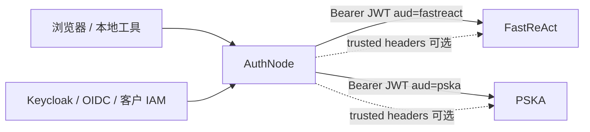

# AuthNode 中文说明

AuthNode 是一个面向 PSKA 和 FastReAct 本地开发的轻量身份适配层。它的作用是把不同来源的登录身份统一整理成下游服务可消费的身份契约，而不是自研一套完整的企业身份平台。

English version: [README.md](README.md)

## 项目定位

AuthNode 做的事情很克制：

- 给本地开发、联调、早期集成提供一个统一登录入口。
- 支持 Local IAM、本地 JSON 开发用户、Keycloak/OIDC 登录。
- 把身份整理成 PSKA/FastReAct 能识别的 JWT 或 trusted headers。
- 不替代公司或客户已有的 OAuth/OIDC/IAM 系统。
- 不是完整 OAuth 2.0 授权服务器。

更直白地说，AuthNode 是一个 "够用就好" 的 identity adapter。它帮助我们在个人开发和联调时有稳定的用户、租户、角色上下文；进入公司或客户环境后，也可以把对方已有的身份系统映射到同一套下游契约。

## 架构边界



AuthNode 负责回答：

- 这个用户是谁？
- 属于哪个 tenant/org？
- 有哪些 roles/groups？
- 下游请求要发给 PSKA 还是 FastReAct？

AuthNode 不负责 PSKA 的知识权限，也不负责 FastReAct 的 workspace、工具策略和 MCP 路由。

## 身份契约

AuthNode 给下游输出的主要 claims：

- `iss`: AuthNode issuer，通常是 `authnode.local`
- `sub`: 稳定身份主体，例如 `pska:user_primary`
- `aud`: `pska`、`fastreact` 或两者
- `tenant_id`: PSKA 使用的 tenant id
- `tenant_key`: FastReAct 使用的 tenant key
- `tenant`、`org_id`: 兼容别名
- `user_id`、`user_key`
- `roles`、`groups`、`email`、`name`
- `provider`: `authnode`、`authnode-local-iam` 或 `keycloak`

PSKA 可以把 `pska:user_primary` 规范化为内部的 `user_primary`。FastReAct 应保留完整的 `user_key`。

详细三方契约见：

- [contracts/authnode-fastreact-pska.md](contracts/authnode-fastreact-pska.md)
- [contracts/pska-coding-agent-authnode-prompt.md](contracts/pska-coding-agent-authnode-prompt.md)

## 环境要求

- Python 3.11+
- `argon2-cffi`
- `PyJWT[crypto]`

开发 AuthNode 本身时建议：

```bash
python3 -m venv .venv
. .venv/bin/activate
python -m pip install -e .
python -m pip install pytest
```

如果系统 Python 已经有依赖，`./start.sh` 也可以直接使用系统 `python3`。

## 快速启动

前台启动：

```bash
./start.sh
```

首次启动时，脚本会从 `authnode.example.json` 创建 `authnode.local.json`，并自动初始化本地使用的 `jwt_secret` 和 `admin_token`。不要提交 `authnode.local.json`。

直接打开浏览器登录入口：

```text
http://127.0.0.1:8788/login?target=pska&return_to=http://127.0.0.1:5173/auth/callback&next=/
```

后台运行：

```bash
./start.sh --daemon
./start.sh --status
./start.sh --stop
```

常用环境变量：

```bash
export AUTHNODE_CONFIG=/path/to/authnode.local.json
export AUTHNODE_HOST=127.0.0.1
export AUTHNODE_PORT=8788
export AUTHNODE_PYTHON=/path/to/python
```

注意：AuthNode 的 `./start.sh` 只启动 AuthNode。PSKA 和 FastReAct 要从它们各自的仓库或容器启动。

## Local IAM

默认示例配置使用 Local IAM：

```json
{
  "browser_login_provider": "local_iam",
  "identity_mode": "hybrid",
  "catalog_store": {
    "type": "sqlite",
    "path": "./data/authnode.db"
  }
}
```

初始化并用示例租户/用户填充 SQLite catalog：

```bash
python -m authnode --config authnode.local.json iam init --seed-config
```

Local IAM 提供：

- SQLite 租户、用户、membership 记录
- Argon2id 密码哈希
- roles/groups
- AuthNode HttpOnly 登录 session
- 登录失败限流
- 审计事件

常用命令：

```bash
python -m authnode --config authnode.local.json tenant list
python -m authnode --config authnode.local.json user list
python -m authnode --config authnode.local.json tenant create tenant_demo --name "Demo Tenant"
python -m authnode --config authnode.local.json user create demo_user --password 'change-me-now' --email demo@example.test
python -m authnode --config authnode.local.json membership add demo_user tenant_demo --roles writer --groups local
python -m authnode --config authnode.local.json user reset-password demo_user --password 'new-password'
python -m authnode --config authnode.local.json audit list --limit 20
```

同样的管理能力也通过 `/v1/iam/*` JSON API 暴露。配置了 `admin_token` 时，需要 `X-AuthNode-Admin-Token` 或 `Authorization: Bearer <admin-token>`。

## 旧版 JSON 开发登录

旧配置可以继续使用：

```json
{
  "browser_login_provider": "local"
}
```

这个模式会检查 JSON 配置里的 `users` 和 `dev_login_password`。它适合烟测，但推荐优先使用 Local IAM。

## Keycloak / OIDC 接入

AuthNode 可以作为 OIDC client 接入 Keycloak，用于更接近生产形态的登录测试：

```json
{
  "browser_login_provider": "keycloak",
  "keycloak": {
    "issuer_url": "http://127.0.0.1:8080/realms/pska-local",
    "client_id": "authnode",
    "client_secret_env": "AUTHNODE_KEYCLOAK_CLIENT_SECRET",
    "redirect_uri": "http://127.0.0.1:8788/oidc/callback",
    "scopes": ["openid", "profile", "email"],
    "tenant_claims": ["tenant_id", "tenant_key"],
    "user_id_claims": ["preferred_username", "sub"],
    "role_claims": ["roles", "realm_access.roles"],
    "group_claims": ["groups"]
  }
}
```

浏览器登录流程使用 authorization code + PKCE。AuthNode 会校验 issuer、audience、nonce、签名算法和 JWKS，然后再签发下游使用的 AuthNode 凭证。

在 Keycloak 模式下，可以用 `GET /login?local=1` 强制显示本地登录表单，方便开发和 E2E 烟测。

## 浏览器登录 code flow

浏览器不应该拿到 PSKA/FastReAct service token、AuthNode admin token 或下游 JWT。

推荐流程：

1. PSKA Gateway 把未登录浏览器重定向到 `GET /login`。
2. AuthNode 通过 Local IAM、旧版本地登录或 Keycloak/OIDC 完成认证。
3. AuthNode 带一个短期一次性 `code` 重定向回 `return_to`。
4. PSKA Gateway 在服务端调用 `POST /v1/auth/exchange`。
5. PSKA Gateway 自己设置 HttpOnly session，后续由服务端代理 API 请求并注入身份。

`/v1/auth/exchange` 只消费 AuthNode 通过 `/login` 创建的一次性 code。它和 `/v1/token` 分开，是为了避免把 AuthNode admin token 暴露给浏览器或下游前端。

## Token 和 Header

签发 JWT：

```bash
python -m authnode --config authnode.local.json token pska:user_primary --tenant tenant_default
python -m authnode --config authnode.local.json token pska:user_primary --audience pska --raw
```

生成 trusted headers：

```bash
python -m authnode --config authnode.local.json headers pska:user_primary --target both
python -m authnode --config authnode.local.json headers pska:user_primary --target pska --curl
```

打印下游服务环境变量：

```bash
python -m authnode --config authnode.local.json env
python -m authnode --config authnode.local.json env --mode trusted_headers
```

如果配置了 `admin_token`，`/v1/token`、`/v1/headers` 和 `/v1/iam/*` 需要：

```http
X-AuthNode-Admin-Token: <admin-token>
Authorization: Bearer <admin-token>
```

## 下游服务配置

FastReAct JWT 模式：

```bash
export FASTREACT_AUTH_MODE=jwt
export AUTHNODE_JWT_SECRET='same-secret-injected-into-authnode'
export FASTREACT_AUTH_JWT_SECRET="$AUTHNODE_JWT_SECRET"
export FASTREACT_AUTH_JWT_ISSUER='authnode.local'
export FASTREACT_AUTH_JWT_AUDIENCE='fastreact'
export FASTREACT_AUTH_JWT_TENANT_CLAIMS='tenant_key,tenant_id,tenant,org_id'
```

PSKA JWT 模式：

```bash
export PSKA_AUTH_MODE=jwt
export AUTHNODE_JWT_SECRET='same-secret-injected-into-authnode'
export PSKA_AUTH_JWT_SECRET="$AUTHNODE_JWT_SECRET"
export PSKA_AUTH_JWT_ISSUER='authnode.local'
export PSKA_AUTH_JWT_AUDIENCE='pska'
export PSKA_AUTH_JWT_TENANT_CLAIMS='tenant_id,tenant_key,tenant,org_id'
```

trusted-header 模式也可用，但必须由 AuthNode 或可信 gateway 先清理调用方传入的身份 header，再注入新的身份 header：

```bash
export FASTREACT_AUTH_MODE=trusted_headers
export PSKA_AUTH_MODE=trusted_headers
```

## 本地代理

AuthNode 可以作为本地代理注入身份：

```bash
curl "http://127.0.0.1:8788/proxy/pska/ready?authnode_user_key=pska:user_primary&authnode_tenant_id=tenant_default"
curl "http://127.0.0.1:8788/proxy/fastreact/ready?authnode_user_key=pska:user_primary&authnode_tenant_id=tenant_default"
```

代理会先移除调用方传入的 `Authorization`、`X-AuthNode-*`、`X-PSKA-*`、`X-FastReAct-*`，再注入 AuthNode 生成的身份材料。

## HTTP API

- `GET /health`
- `GET /ready`
- `GET /login`
- `POST /login`
- `GET /oidc/callback`
- `GET /logout`
- `POST /v1/auth/exchange`
- `GET /v1/tenants`
- `GET /v1/users`
- `POST /v1/token`
- `GET /v1/headers`
- `GET/POST/DELETE /v1/iam/tenants`
- `GET/POST/DELETE /v1/iam/users`
- `POST/DELETE /v1/iam/memberships`
- `POST/DELETE /v1/iam/roles`
- `POST /v1/iam/provider-accounts`
- `GET /v1/iam/audit`
- `ANY /proxy/{target}/{path}`

`/v1/token` 请求示例：

```json
{
  "user_key": "pska:user_primary",
  "tenant_id": "tenant_default",
  "audience": ["fastreact", "pska"],
  "ttl_seconds": 28800
}
```

`/v1/headers` 查询示例：

```text
/v1/headers?user_key=pska:user_primary&tenant_id=tenant_default&target=both&mode=trusted_headers
```

## 契约检查

离线检查：

```bash
python -m authnode --config authnode.local.json contract pska:user_primary --tenant tenant_default
```

调用 PSKA `/ready` 的 live 检查：

```bash
python -m authnode --config authnode.local.json contract pska:user_primary \
  --tenant tenant_default \
  --live \
  --pska-url http://127.0.0.1:8765
```

只有明确需要真实 FastReAct agent 调用时才加 `--fastreact-chat`：

```bash
python -m authnode --config authnode.local.json contract pska:user_primary \
  --tenant tenant_default \
  --live \
  --fastreact-url http://127.0.0.1:8000 \
  --fastreact-chat
```

## 严格身份模式

更接近生产的本地测试可以启用：

```json
{
  "strict_identity": true,
  "admin_token": "local-admin-token",
  "allow_unknown_users": false,
  "allow_unknown_tenants": false
}
```

严格模式会拒绝未知用户和未知租户。`/v1/token` 和 `/v1/headers` 也必须配置 `admin_token` 才可用。

## 开发与测试

运行测试：

```bash
python -m pytest -q
```

检查启动脚本语法：

```bash
bash -n start.sh
```

常用源码入口：

- `authnode/server.py`: HTTP 路由、登录流程、代理、admin-token 检查
- `authnode/oidc.py`: Keycloak/OIDC discovery、PKCE、token 校验、JWKS
- `authnode/catalog.py`: Local IAM catalog、session、密码哈希、审计
- `authnode/identity.py`: AuthNode JWT 和 trusted-header claims
- `authnode/config.py`: JSON 配置模型和默认值
- `authnode/cli.py`: CLI 命令
- `tests/test_authnode.py`: Local IAM、OIDC、proxy、契约测试

本地运行产物：

- `authnode.local.json`: 本地 secret 和配置，Git 忽略
- `data/authnode.db`: Local IAM SQLite 数据库，Git 忽略
- `logs/`: daemon 日志，Git 忽略
- `run/`: daemon PID 文件，Git 忽略

## 安全注意事项

- 不要提交 `jwt_secret` 和 `admin_token`。
- 非本地环境中，AuthNode、PSKA、FastReAct 应通过部署 secret 注入同一个 JWT secret。
- 优先使用 Local IAM 或 OIDC，不推荐继续扩展旧版 JSON 开发登录。
- 不要把 `/v1/token`、`/v1/headers` 或 `/v1/iam/*` 直接暴露给浏览器。
- trusted-header 模式只能放在可信边界后面，且必须先清理调用方传入的身份 header。
- 接入公司或客户 IAM 时，尽量把 OAuth/OIDC 细节留在 AuthNode 或 gateway 层。PSKA/FastReAct 继续消费稳定身份契约。

## 排查问题

检查 AuthNode 是否响应：

```bash
./start.sh --status
curl http://127.0.0.1:8788/ready
```

如果 `--status` 显示服务在响应但没有 daemon PID，说明它是前台启动的，需要在启动它的终端里按 `Ctrl-C` 停止。

如果登录成功但下游拒绝请求，重点检查：

- downstream `audience`
- `jwt_secret` 是否一致
- `iss` / issuer 配置
- tenant claim 顺序
- PSKA 是否使用 `tenant_id`
- FastReAct 是否使用 `tenant_key`

如果 Keycloak 登录失败，重点检查：

- `keycloak.issuer_url`
- `keycloak.client_id`
- `keycloak.redirect_uri`
- `AUTHNODE_KEYCLOAK_CLIENT_SECRET`
- OIDC token 里是否有 tenant/user claims
